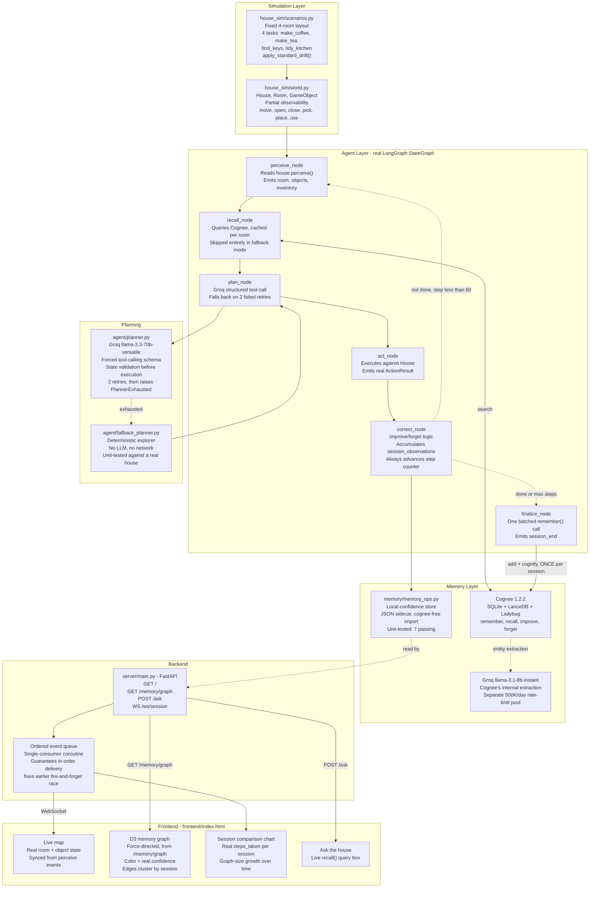
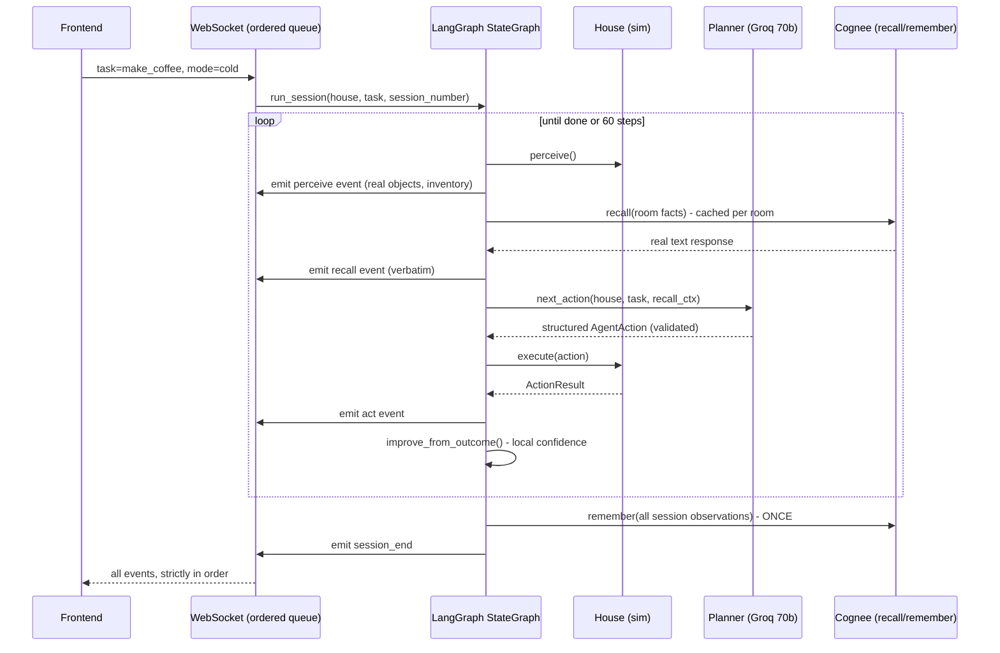
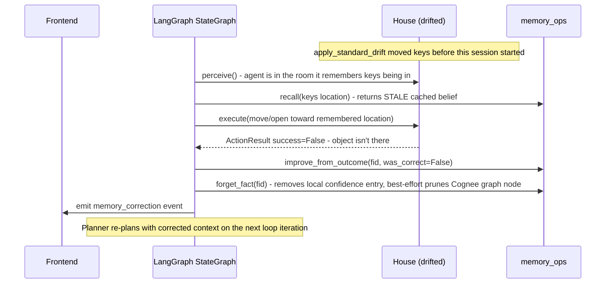
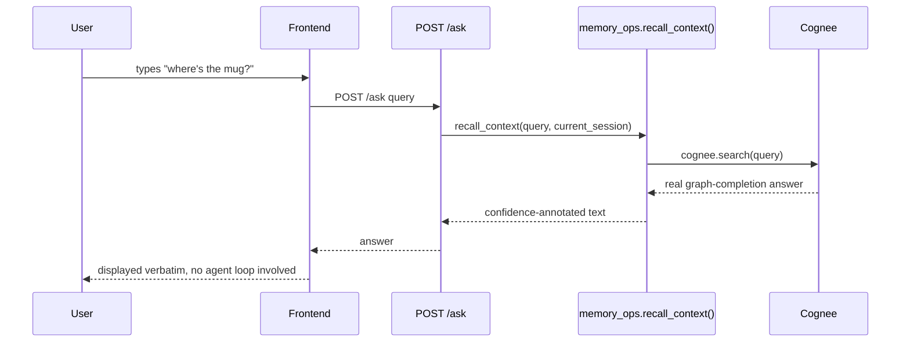
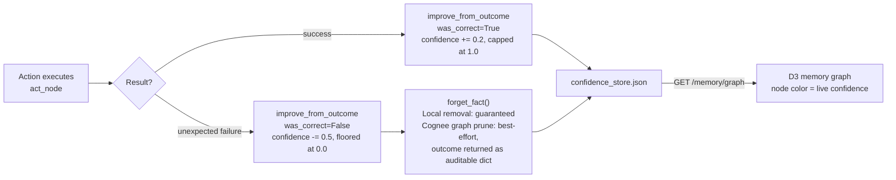

# Amnesia — Architecture

## Overview

Amnesia is an embodied task-planning agent operating in a simulated house. A real, compiled
LangGraph `StateGraph` drives a six-node loop (perceive to recall to plan to act to correct to
finalize) that plans actions via a Groq-backed LLM (with a deterministic fallback), reads and
writes long-term memory through Cognee's lifecycle API, and streams every step live to a
FastAPI + WebSocket frontend with a real-time D3 force-directed memory graph.

---

## System Diagram

---

## Sequence - A Full Session (cold to memory)

---

## Sequence - Drift Correction (session 3)

---

## Sequence - "Ask the House" (live query)

---

## Component Map

| File | Responsibility |
|---|---|
| `house_sim/world.py` | `House`, `Room`, `GameObject` dataclasses; the action API (move/open/close/pick/place/use); partial observability via `perceive()` |
| `house_sim/scenarios.py` | Fixed 4-room house layout; `TASKS` dict (make_coffee, make_tea, find_keys, tidy_kitchen); `apply_standard_drift()` |
| `agent/schemas.py` | `AgentAction` Pydantic model; `AGENT_ACTION_TOOL` forced tool-calling schema for Groq |
| `agent/fallback_planner.py` | Deterministic, no-LLM explorer - the safety net when the LLM planner fails twice |
| `agent/planner.py` | `LLMPlanner` - Groq structured tool-calling, pre-execution state validation, capped retries, raises `PlannerExhausted` |
| `agent/graph.py` | The real `langgraph.graph.StateGraph` - 6 nodes, 1 conditional loop-back edge, compiled once and reused |
| `memory/cognee_config.py` | Explicit provider configuration; refuses to run unconfigured rather than silently defaulting to a paid provider |
| `memory/memory_ops.py` | `remember_observation` / `recall_context` / `improve_from_outcome` / `forget_fact`; local confidence-store sidecar; lazy `cognee` import so the pure logic is testable without Cognee installed |
| `server/main.py` | FastAPI app; `GET /memory/graph`, `POST /ask`, `WS /ws/session` with a single-consumer ordered event queue |
| `frontend/index.html` | Live map (real object/room state), D3 force-directed memory graph, session comparison chart, ask-the-house box, optional voice narration, auto-demo sequencer |
| `scripts/run_session.py` | CLI runner - the day-1/day-2 test harness, works with zero AI dependencies via `--fallback-only` |
| `scripts/init_cognee.py` | One-time Cognee database schema initialization |
| `tests/test_world.py` | 9 tests - simulation correctness + fallback planner verification |
| `tests/test_memory_ops.py` | 7 tests - confidence-tracking logic, zero Cognee dependency |

---

## Why Two Different Groq Models

| Model | Used by | Rate limit (free tier) | Why |
|---|---|---|---|
| `llama-3.3-70b-versatile` | `agent/planner.py` | 100K tokens/day | Needs real reasoning for action planning; makes few, short calls per session |
| `llama-3.1-8b-instant` | Cognee's internal entity/relation extraction | 500K tokens/day, separate pool | Extraction doesn't need frontier reasoning but calls more often per `cognify()` pass |

Splitting these fixed a real rate-limit exhaustion bug hit during development - both workloads
sharing the 70B model's 100K/day pool burned the entire daily budget in 2-3 sessions.

---

## Why remember() Is Batched to Session-End

The first implementation called `remember_observation()` after every single action. `cognify()`
resolves the entire accumulated graph to text and runs LLM extraction on every call - so this
meant every action was several sequential LLM round-trips, and cost scaled with graph size,
getting slower every step. Batching to one call per session (in `finalize_node`) is the
architecturally correct fix: real memory consolidation happens at natural checkpoints, not
continuously. Found and fixed during development by observing rate-limit exhaustion in production
logs, not designed in from the start.

---

## Data Flow - Confidence and Correction

---

## Tech Stack

| Layer | Technology | Version/Detail |
|---|---|---|
| Simulation | Pure Python dataclasses | No external dependencies |
| Orchestration | LangGraph | `StateGraph`, compiled once, reused across sessions |
| Planning (primary) | Groq `llama-3.3-70b-versatile` | Forced tool-calling via the `groq` Python SDK |
| Planning (fallback) | Hand-rolled deterministic explorer | Zero dependencies, unit-tested |
| Memory | Cognee | `1.2.2`, SQLite + LanceDB + Ladybug (zero-setup local stack) |
| Memory extraction | Groq `llama-3.1-8b-instant` | Routed via LiteLLM's `groq/` prefix, `LLM_PROVIDER=custom` |
| Embeddings | Fastembed | `BAAI/bge-small-en-v1.5`, 384 dimensions, local |
| Backend | FastAPI + WebSocket | Single-consumer ordered event queue |
| Frontend | Vanilla JS + D3.js | Force-directed simulation via `d3.forceSimulation` |
| Testing | Zero-dependency assert-based runners | `python tests/test_world.py`, no pytest required |

---

## Environment Variables

| Variable | Purpose |
|---|---|
| `LLM_PROVIDER` | Must be `custom` (not `groq`) - Cognee routes Groq via LiteLLM's `groq/` model prefix |
| `LLM_MODEL` | `groq/llama-3.1-8b-instant` - Cognee's internal extraction model |
| `LLM_API_KEY` | Groq API key, used by Cognee internally |
| `EMBEDDING_PROVIDER` | `fastembed` |
| `EMBEDDING_MODEL` | `BAAI/bge-small-en-v1.5` |
| `EMBEDDING_DIMENSIONS` | `384` - must be set explicitly or Cognee guesses wrong for this model |
| `GROQ_API_KEY` | Used directly by `agent/planner.py`, separate from Cognee's internal calls |
| `PLANNER_MODEL` | `llama-3.3-70b-versatile` - the planner's model |
| `ENABLE_BACKEND_ACCESS_CONTROL` | `false` - disables Cognee's multi-user auth for local solo use |
| `CACHING` | `false` - disables Cognee's session-memory caching during development |

---

*Built for WeMakeDevs x Cognee - "The Hangover Part AI: Where's My Context?", June 29 - July 5, 2026*