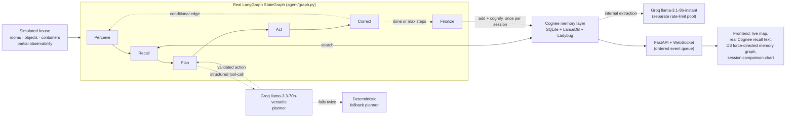

<div align="center">


</div>

<p align="center">
  
  
  
  
  
  
  
</p>

<p align="center">
  <strong>WeMakeDevs × Cognee — "The Hangover Part AI: Where's My Context?" — June 29 – July 5, 2026</strong><br/>
  <strong>Track: Best Use of Open Source Cognee</strong>
</p>

<p align="center">
  📐 <a href="#architecture">Architecture</a> &nbsp;•&nbsp;
  🧠 <a href="#the-memory-lifecycle-doing-real-work">Memory Lifecycle</a> &nbsp;•&nbsp;
  ⚡ <a href="#setup">Setup</a> &nbsp;•&nbsp;
  🧪 <a href="#tests">Tests</a> &nbsp;•&nbsp;
  🔗 <a href="https://github.com/ashish-doing/amnesia">GitHub</a>
</p>

---

> *This hackathon is called "Where's My Context?" — so this agent literally has the amnesia problem,
> and the only cure is Cognee.*

Amnesia is an embodied task-planning agent operating in a simulated house — symbolic, not physics,
partial observability, a real action API (`move`, `open`, `pick`, `place`, `use`). It has to find
things and complete real household tasks. The only thing that makes it faster across sessions is
what Cognee's memory lifecycle lets it remember.

**Demo video:** `[ADD YOUTUBE/DRIVE LINK HERE BEFORE SUBMITTING]`
**Live demo:** none — deliberately local-only (see [Known Limitations](#known-limitations))

---

## The result, stated as numbers

| Session | Task | Mode | Actions | Why |
|---|---|---|---|---|
| 1 | `make_coffee` | cold start | ~8–13 | Explores blind — opens things one by one to find the mug, coffee, kettle |
| 2 | `make_coffee` | with memory | ~5–6 | Same house, brand-new process — only Cognee's persistent memory carried over |
| 3 | `make_coffee` | world drift | varies | An object is deliberately moved between sessions — agent's cached belief is wrong, it fails once, self-corrects via `forget()` |
| 4 | `make_tea` | with memory | low | **Never trained on this exact task** — `recall()` generalizes semantically over the same kitchen facts |
| 5 | `tidy_kitchen` | with memory | low | A genuinely different goal (put things away, not find things), reusing the same shared memory |

*(Run "Run full demo" in the frontend, or the CLI sequence in [Setup](#setup), to reproduce these
live — re-verify the exact numbers on your own run before quoting them anywhere. Note: `tidy_kitchen`
only demonstrates cleanup behavior meaningfully as a follow-up to a `make_coffee` session in the
same house — on a fresh house the cabinet already starts closed, so the task is trivially
pre-satisfied. This is by design, not a bug, but worth knowing before demoing it standalone.)*

---

## The memory lifecycle doing real work

| Call | Where it fires | Why it's not decorative |
|---|---|---|
| `recall()` | Before every planning step, cached per room within a session | The actual text Cognee returns is shown live in the UI — not summarized, not hidden behind a counter |
| `remember()` | Once per session, batched at session end | Deliberate cost/architecture fix — see [Architecture](#architecture) for why |
| `improve()` | After every action, based on whether it succeeded | A local confidence score per fact, reinforced on success, penalized on failure — visualized directly as node color in the memory graph. Unit-tested in `tests/test_memory_ops.py` |
| `forget()` | Specifically on the drift-correction path | Local confidence removal is guaranteed; the underlying Cognee graph-node prune is attempted and its real outcome (success/failure) is returned as a dict, not silently assumed |

---

## Architecture



`agent/graph.py` is a real, compiled `langgraph.graph.StateGraph` with six nodes and one
conditional loop-back edge — not a plain `for` loop with LangGraph terminology bolted onto the
comments. Verified by actually running it end-to-end with the deterministic fallback planner
(no API keys needed) before this was written down as a claim.

**Why two different Groq models:** `llama-3.3-70b-versatile` (100K tokens/day free tier) drives the
planner, which needs real reasoning but makes few, short calls. `llama-3.1-8b-instant` (500K
tokens/day, a *separate* rate-limit pool) drives Cognee's internal entity/relation extraction, which
doesn't need frontier reasoning but calls more often. Splitting them fixed a real rate-limit
exhaustion bug hit during development.

**Why `remember()` is batched to session-end, not per-action:** the first implementation called it
after every action, which triggered a full graph re-resolution + LLM extraction pass on *every
single step* — this burned Groq's entire free-tier daily budget in 2–3 sessions and made each
action several sequential LLM round-trips. Batching to session boundaries is the architecturally
correct fix (real memory consolidation happens at natural checkpoints, not continuously) — found
and fixed during development, not designed in from the start.

**Ordering guarantee:** the WebSocket layer uses a single-consumer event queue (`server/main.py`),
not fire-and-forget `asyncio.create_task()` calls — an earlier version had a real race condition
where rapid events could arrive at the browser out of order. Fixed and not re-introduced.

---

## What the frontend actually shows

Everything here is sourced from real backend state, not mocked for the demo:

- **Live map** — the agent's actual current room, connections, and real visible objects (from
  `house.perceive()`), synced from the backend on every step — including inventory, which is read
  from real ground truth rather than guessed client-side from individual pick/place events.
- **Real Cognee output, verbatim** — every `recall()` query and the real text Cognee returned,
  printed live, not summarized behind a counter.
- **Memory graph (D3 force-directed)** — every node is pulled from `GET /memory/graph`, which reads
  the actual confidence-store file the agent writes to. Node color reflects real confidence
  (cyan = trusted, amber = decaying, red = stale). Edges cluster by the session that actually
  produced each fact.
- **Session comparison chart** — real `steps_taken` returned from the backend after each run,
  plus real memory-graph size growth per session.
- **"Ask the house"** — type a question, get a live answer straight from `recall()`, on demand.
- **`house_reset` signal** — the frontend is told explicitly whenever the simulation is rebuilt
  from scratch (cold start), rather than silently reusing stale client-side assumptions about house
  state across mode switches.
- **Optional voice narration** — the agent's real planning `thought` text, spoken via the browser's
  native Web Speech API.

---

## Known limitations

- **This is a symbolic simulation, not a physical robot or a physics engine.** The
  perceive → recall → plan → act → correct → finalize architecture is designed to port to a real
  controller; a short solo window intentionally excluded physics/hardware risk.
- **No live hosted deployment.** Cognee's local SQLite + LanceDB + Ladybug files live on disk;
  free hosting tiers (Render/Railway) have ephemeral filesystems that would wipe them on
  redeploy/sleep — which would silently break the entire "memory persists across sessions" premise.
  A local demo video substitutes for a hosted link.
- **The LLM planner is the least deterministic part of the system.** Structured-output tool-calling
  schemas, pre-execution state validation, capped retries, and a deterministic rule-based fallback
  planner (unit-tested against a real house) exist specifically because of this.
- **`tidy_kitchen` is contextual by design** — it only meaningfully tests cleanup behavior as a
  follow-up to a `make_coffee` session in the same house instance, not standalone on a fresh house.
- **`forget()`'s Cognee-side graph pruning is best-effort, not guaranteed** — the local confidence
  store removal always succeeds; the underlying Cognee graph-node deletion depends on the installed
  version's API surface and its real outcome is returned as an auditable dict, not assumed.
- **No screenshots or demo video are embedded in this README yet** — add them before submitting.

---

## Setup

```bash
git clone https://github.com/ashish-doing/amnesia
cd amnesia
python -m venv .venv
.venv\Scripts\activate          # Windows
# source .venv/bin/activate     # macOS/Linux

pip install -r requirements.txt

cp .env.example .env
# Fill in your Groq key (console.groq.com/keys) for both LLM_API_KEY and GROQ_API_KEY
```

Run the day-1 path first — zero AI dependencies, proves the simulation itself is correct:

```bash
python tests/test_world.py
python tests/test_memory_ops.py
python scripts/run_session.py --task make_coffee --fallback-only
```

Then the real loop:

```bash
python scripts/run_session.py --task make_coffee --mode cold --session-number 1
python scripts/run_session.py --task make_coffee --mode memory --session-number 2
```

Then the live frontend:

```bash
uvicorn server.main:app --reload --port 8060
```
Open `frontend/index.html` in a browser, click **Run full demo**.

---

## Tests

```bash
python tests/test_world.py       # 9 passed
python tests/test_memory_ops.py  # 7 passed
```

| File | Test | What it verifies |
|---|---|---|
| `test_world.py` | `test_house_builds` | The house layout initializes with correct starting state |
| `test_world.py` | `test_move_valid` / `test_move_invalid` | Movement respects room connectivity, rejects unreachable rooms |
| `test_world.py` | `test_open_and_pick` | Containers must be opened before their contents are reachable |
| `test_world.py` | `test_pick_closed_container_contents_fails` | Can't pick an item still inside a closed container |
| `test_world.py` | `test_make_coffee_task_completable_manually` | The `make_coffee` success condition is actually satisfiable |
| `test_world.py` | `test_drift_moves_object` | The world-drift scenario genuinely relocates an object between sessions |
| `test_world.py` | `test_tidy_kitchen_task_completable_manually` | The `tidy_kitchen` success condition is actually satisfiable |
| `test_world.py` | `test_fallback_planner_returns_valid_actions_against_real_house` | The safety-net planner referenced everywhere is itself verified, not assumed correct |
| `test_memory_ops.py` | `test_improve_from_outcome_*` (5 tests) | Confidence scoring initializes, increases, decreases, and clamps correctly |
| `test_memory_ops.py` | `test_load_confidence_returns_empty_dict_when_no_file` | Fresh installs don't crash on a missing confidence store |
| `test_memory_ops.py` | `test_save_and_load_round_trip` | The confidence store persists and reloads accurately |

`test_memory_ops.py` deliberately requires zero Cognee dependency — `memory_ops.py`'s `cognee`
import is lazy (loaded only inside the functions that actually call it), specifically so this
pure confidence-tracking logic can be tested without Cognee installed at all.

---

## Tech stack

| Layer | Technology | Role |
|---|---|---|
| Simulation | Pure Python dataclasses | Deterministic house/room/object model, partial observability |
| Orchestration | **LangGraph `StateGraph`** | Real 6-node graph with a conditional loop-back edge, compiled and run |
| Planning | Groq `llama-3.3-70b-versatile` via forced tool-calling | Structured action schema — can't emit an invalid action shape |
| Fallback planning | Hand-rolled deterministic explorer | Guarantees task completion if the LLM planner fails twice in a row |
| Memory | Cognee 1.2.2 (`remember`/`recall`/`improve`/`forget`) | SQLite + LanceDB + Ladybug, zero-setup local stack |
| Memory extraction | Groq `llama-3.1-8b-instant` via LiteLLM (`groq/` prefix) | Separate rate-limit pool from the planner |
| Embeddings | Fastembed (`BAAI/bge-small-en-v1.5`, 384-dim) | Local, free, no API key |
| Backend | FastAPI + WebSocket (ordered event queue) | Live session streaming, `/ask`, `/memory/graph` endpoints |
| Frontend | Vanilla JS + D3.js (force simulation) | Live map, real-time memory graph, session comparison chart |

---

## Project structure

amnesia/
├── house_sim/
│   ├── world.py            Core simulation: rooms, objects, containers, action API
│   └── scenarios.py        Fixed house layout, task definitions, drift scenario
├── agent/
│   ├── schemas.py          Structured action schema (planner guardrail)
│   ├── fallback_planner.py Deterministic, no-LLM planner
│   ├── planner.py          Groq LLM planner with validation + capped retries
│   └── graph.py            Real LangGraph StateGraph: perceive→recall→plan→act→correct→finalize
├── memory/
│   ├── cognee_config.py    Explicit provider config (refuses to run unconfigured)
│   └── memory_ops.py       remember/recall/improve/forget + local confidence tracking
├── server/
│   └── main.py             FastAPI + WebSocket (ordered queue) + /ask + /memory/graph
├── frontend/
│   └── index.html          Live map, real Cognee output, D3 memory graph, session chart
├── scripts/
│   ├── run_session.py      CLI runner for standalone testing
│   └── init_cognee.py      One-time DB schema initialization
├── tests/
│   ├── test_world.py       9 simulation + fallback-planner tests
│   └── test_memory_ops.py  7 zero-Cognee-dependency confidence-tracking tests
├── SUBMISSION.md            Claims audit + timed demo script
└── requirements.txt

---

## Author

**Ashish Kumar** — B.Tech ECE, IIIT Guwahati (Batch 2024)

[](https://github.com/ashish-doing)
[](https://linkedin.com/in/ashish-kumar-014aaa3b9)

---

## AI-assistant disclosure

Built solo, with AI-assistant (Claude) help for architecture planning, code scaffolding, debugging,
and this README. Disclose this explicitly in the submission form.

---

## License

MIT